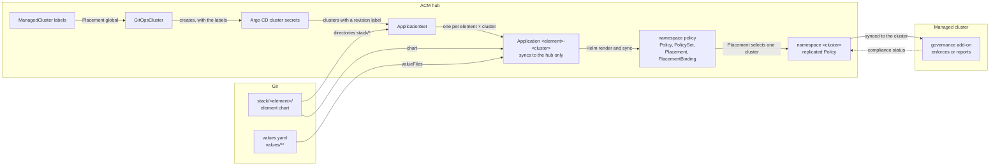

# PolicyStack

PolicyStack manages OpenShift cluster configuration as Red Hat Advanced Cluster Management (ACM) policies kept in Git. Each directory under `stack/` is an element. A Helm chart that renders policies through the [policy-library](https://github.com/PolicyStack/PolicyStack-chart/blob/main/charts/policy-library/README.md) chart. On the ACM hub, an Argo CD ApplicationSet creates one Application per element for every managed cluster labeled with a Git revision. Argo CD renders each Application at that revision and syncs it to the hub only. ACM delivers each policy to the single cluster it targets, where the governance add-on enforces it or reports compliance.

## How a change reaches a cluster

1. Change an element, the root `values.yaml` or a file under `values/` on the branch or tag that the cluster's revision label pins. Clusters pinned to other revisions are unaffected.
2. Argo CD renders the element chart with the cluster's [values cascade](values.md#order) and syncs the Policy, PolicySet, Placement and PlacementBinding objects into the `policy` namespace on the hub.
3. The [Placement](policies.md#placement) selects only that cluster. ACM replicates each Policy into the cluster's namespace on the hub, and the governance add-on on the managed cluster applies it. `enforce` changes the cluster, `inform` only reports. Compliance status returns to the replicated Policy on the hub.

## Terms

| Term | Meaning |
|---|---|
| [Element](elements.md) | A directory under `stack/` holding a Helm chart that depends on the policy-library chart. Its values define the policies it renders. |
| [Hub](install.md#prerequisites) | The cluster that runs ACM and OpenShift GitOps. It runs the ApplicationSet and holds the Applications and Policies. By default ACM also manages the hub as `local-cluster`, so it can carry a revision label like any other managed cluster. |
| [Managed cluster](rollout.md#onboarding-a-cluster) | A cluster that ACM manages and the GitOpsCluster imports into Argo CD. It gets one Application per element once it carries the revision label. |
| [Release](applicationset.md#applications) | The Application name, which Argo CD also uses as the Helm release name. `<element>-<cluster>`, or `<element>-acm-<datacenter>` on the hub. Policy, PolicySet, Placement and PlacementBinding names are built from it. |
| [Revision](applicationset.md#cluster-labels) | The Git branch or tag in a cluster's `git.<baseDomain>/revision` label. All of that cluster's Applications render from it. |
| [Values cascade](values.md#order) | The values files Argo CD passes to Helm for one Application, most of them chosen from the cluster's labels. Later files override earlier ones. |
